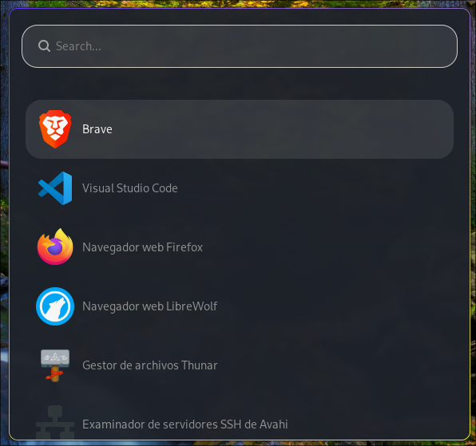
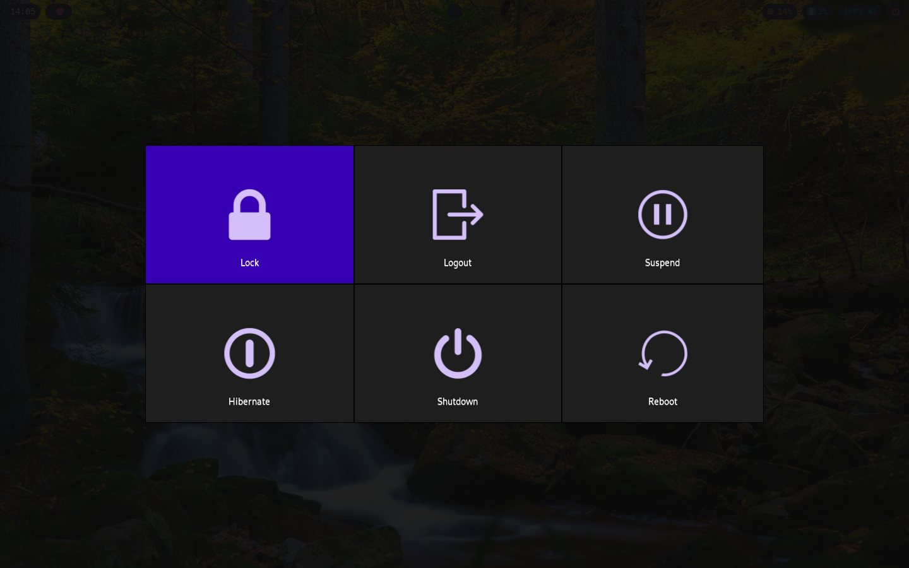

# HyprMin 🖥️
Dotfiles: Hyprland con waybar, wofi, hyprpaper, wlogout.
## Ten en cuenta ⚙️
* **OS** : Arch Linux
* **Terminal** : Alacritty
* **App Launcher** : Wofi
* **Status Bar** : Waybar
* **Wallpaper** : Hyprpaper
* **File Manger** : Thunar
### Como Instalar
```sh
cd $HOME
git clone https://github.com/D3v1f/HyprMin.git
cd HyprMin/
chmod +x HyprMinInstall.sh
./HyprMinInstall.sh
```
#### Cuidado 📢
* Si el fondo de pantalla esta oscuro necesitamos cambiar un valor en Hyprpaper con : ```cd .config/hypr/```
```sh
chmod +x output.sh
./output.sh
```
* Necesariamete debes iniciar Hyprland para que el script se ejecute correctamente!!
## Setup 
  
  
  
  
   
